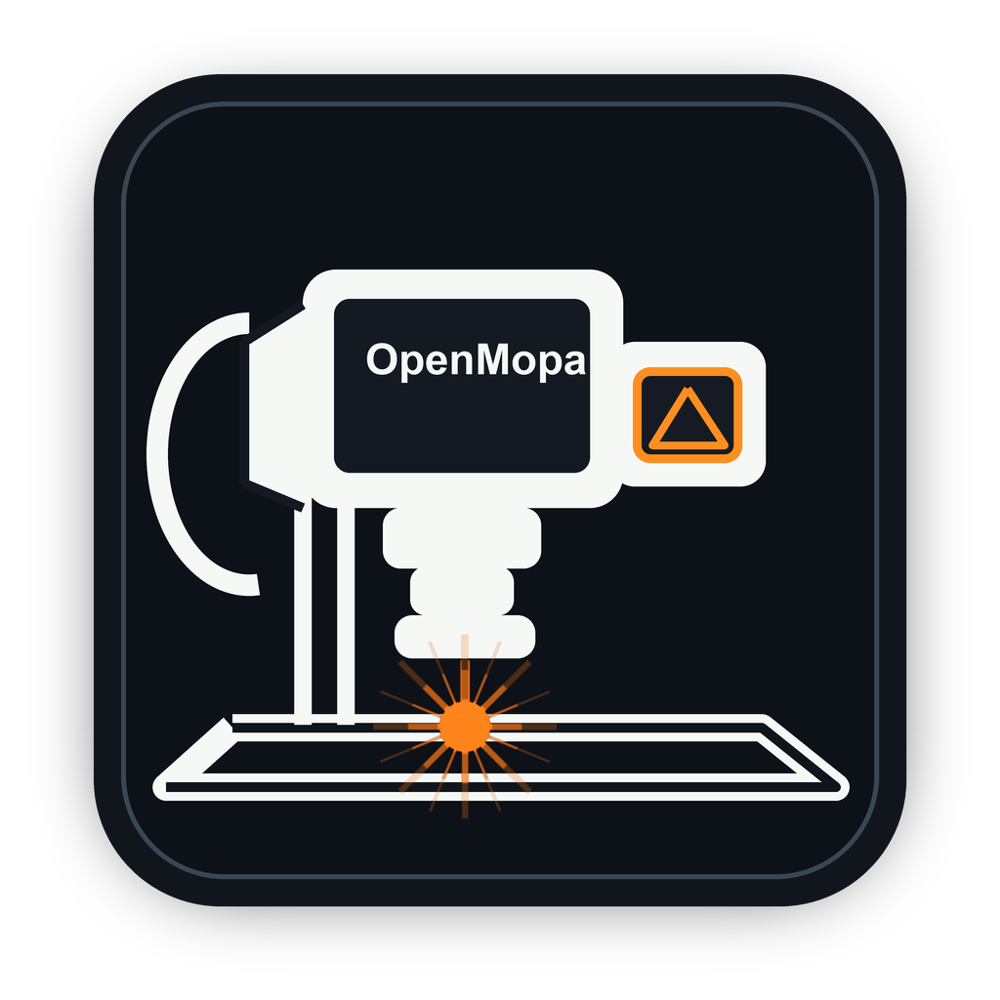

# OpenMopa

<p align="center">
  
</p>

Safety-first prototype for controlling a JCZ/BJJCZ LMC fiber galvo with a JPT
M7 60 W MOPA source on macOS. Inspired by LightBurn, built on top of
`galvoplotter` for the protocol layer.

This project does not modify the EZCAD folder. The active EZCAD profile
(`markcfg7`) is read as a calibrated reference; only the parsed values are
used. Default behavior is dry-run / red-light framing only. Laser emission
happens only after explicit ARM and a final confirmation, and only inside
the current safety policy.

## Quick start (macOS)

Create a virtual environment with your local hardware dependencies installed,
then run:

```bash
python -m mopa_luiz ui --markcfg /path/to/your/EZCAD/plug/markcfg7
```

You can also set the profile once:

```bash
export MOPA_MARKCFG=/path/to/your/EZCAD/plug/markcfg7
python -m mopa_luiz ui
```

Then open `http://127.0.0.1:8765`.

Optional local launcher: build `OpenMopa.app` from `scripts/launcher.applescript`.
A Terminal window
opens showing the running server, and your browser opens automatically at
`http://127.0.0.1:8765`. To stop the app, close the Terminal window.

If the server is already running when you double-click, the launcher
detects it and just opens the browser to the existing URL — no second
Terminal, no port collision.

You can drag the generated `OpenMopa.app` to the Dock or copy it to
`/Applications/`.

> The launcher is an AppleScript-compiled bundle (`Contents/MacOS/applet`
> is a Mach-O binary that macOS allows to run unsigned). The source lives
> at `scripts/launcher.applescript`. Rebuild with:
> ```bash
> osacompile -o "OpenMopa.app" scripts/launcher.applescript
> ```

Desktop / package icons are in `assets/icons/`:

- `openmopa.icns` for macOS.
- `openmopa.ico` for Windows.
- `openmopa.png` plus sized PNGs for Linux and Docker/Desktop launchers.

## Command line

```bash
.venv/bin/python -m mopa_luiz detect
.venv/bin/python -m mopa_luiz show-config
.venv/bin/python -m mopa_luiz pulse-widths
.venv/bin/python -m mopa_luiz inspect-profile
.venv/bin/python -m mopa_luiz plan-test-box --power 1 --frequency-khz 30 --pulse-width-ns 200
.venv/bin/python -m mopa_luiz ui
```

## Safety policy

All laser-emission paths flow through `mopa_luiz/safety.py:evaluate_emission`
before the controller is touched.

- Power may be set anywhere in the laser's electrical 0..100% range.
- Pulse width is snapped to the guarded JPT M7 table; values that don't
  land on the table within rounding are rejected.
- Frequency must lie within `markcfg7`'s `MINPWMFREQ` / `MAXPWMFREQ` bounds.
- Live marking still requires typing `ARM` in the UI plus a final
  confirmation in the modal.
- Use red-light framing (Frame Once / Continuous Frame) before marking.
- Raster engrave layers emit hatch-fill scan lines for closed regions.
  Open raster paths are skipped and reported.

## UI features

Run with the generated `.app` (above) or with
`python -m mopa_luiz ui --markcfg /path/to/markcfg7`, then open
`http://127.0.0.1:8765`.

**Import**

- `.svg`, `.dxf`, `.stl`.
- DXF supports `LINE`, `LWPOLYLINE` including bulge arcs, old-style
  `POLYLINE` / `VERTEX` / `SEQEND`, `CIRCLE`, `ARC`, `ELLIPSE`, fit-point
  `SPLINE`, and control-point `SPLINE` approximation. DXF imports preserve
  CAD Y-up orientation, which is important for Rhino exports.
- Imported paths are split into separately selectable objects so individual
  DXF lines can be assigned to different layers.
- SVG paths only handle `M / L / H / V / Z`; Bezier and arc commands are
  not flattened in this prototype.

**Canvas**

- 200 mm field with a self-scaling ruler: tick marks every 1 / 2 / 5 / 10
  / 20 / 50 / 100 mm depending on zoom, mm labels along the bottom and
  left edges, plus a labelled scale bar in the lower-right corner.
- Mouse-wheel zoom (cursor-anchored), `Fit` / `100%` buttons, zoom
  percentage readout, mm cursor readout.
- Switch between `Cursor` and `Pan` with the in-canvas buttons. Pan also
  works with middle-mouse drag, or hold Space and drag with the left button.
- Collapse either sidebar with the in-canvas edge buttons.
- `Undo` / `Redo` buttons plus `Cmd-Z` / `Shift-Cmd-Z` for geometry edits.
- `f` fits to objects, `0` resets to 100% / field view.

**Selection**

- Click an object on the canvas or in the list. Shift-click adds or removes
  from the selection.
- Drag an empty part of the canvas to window-select every object whose
  bounding box is fully inside the selection rectangle. Shift-drag adds to the
  current selection.
- Double-click a line/object to select its connected endpoint component. This
  selects closed rectangles, polygons, stars, and other edge-connected chains
  without selecting unrelated crossing lines that only intersect mid-segment.
- `Delete` / `Backspace` removes the selection.
- The object browser is intentionally capped and scrollable so large DXF
  imports do not push layer/edit controls off-screen.
- The Transform panel applies to the single-selected object.
- Center Selection, Center All, and Move Center To Ref move selected geometry
  around explicit reference coordinates.

**Layers**

Four default layers; each has independent operation, power, frequency,
pulse, speed, passes, output, visibility, and color.

| Layer                   | Operation        | Defaults                |
| ----------------------- | ---------------- | ----------------------- |
| Vector Engrave          | `vector_engrave` | 100% / 30 kHz / 200 ns / 1000 mm·s |
| Vector Cut / Deep Mark  | `vector_cut`     | 100% / 30 kHz / 200 ns / 300 mm·s  |
| Raster                  | `raster_engrave` | hatch fill, 0.1 mm pitch, angle 0°, +90° per pass |
| Frame Only              | `frame_only`     | no emission             |

- `Move selection here` in the Cuts / Layers module moves selected objects
  onto the active layer.
- Layer settings persist locally in `layer_settings.json`, which is ignored by git.
- The right-panel `Selected only` toggle limits planning, red-light framing,
  continuous framing, and marking to the current canvas selection.

**Raster fill (EZCAD/LightBurn-style hatch)**

Raster layers fill closed regions with hatch lines instead of tracing the
outline. The algorithm matches what LightBurn calls "Fill" and EZCAD calls
"Hatch":

1. Closed polylines are detected (a path that returns to its start within
   tolerance). Open paths on a raster layer are skipped — the UI reports
   them but the laser does nothing.
2. Each closed shape is rotated so the chosen hatch angle becomes
   horizontal.
3. Horizontal scan lines sweep across the bounding box at `pitch_mm`
   spacing. Each scan line records the X positions where it crosses any
   region boundary.
4. The crossings are sorted, then paired even-odd: 0..1 is inside, 1..2
   is in a hole, 2..3 is inside again, etc. This is the same fill rule
   SVG and most CAD tools use; **letter holes (the inside of an "O", the
   triangular hole of an "A") are skipped naturally** because the scan
   line crosses the inner boundary an even number of times.
5. Hatch segments are rotated back to world coordinates.
6. For multi-pass output, the angle is incremented by `angle_step_deg`
   per pass: pass 1 at 0°, pass 2 at 90° gives a cross-hatch fill.
7. Boustrophedon ordering — the direction of every other scan line is
   flipped so the galvo doesn't fly all the way back to the start of
   each row, cutting jump-time roughly in half.

Raster controls in the layer panel:

| Field               | Meaning                                    |
| ------------------- | ------------------------------------------ |
| `Hatch angle deg`   | Direction of the first pass (0° = horizontal) |
| `Pitch mm`          | Distance between adjacent hatch lines      |
| `Angle step / pass` | Degrees added per pass (90° = cross-hatch) |
| `Passes`            | Number of passes (uses the same field as vector layers) |

The canvas shows a live preview overlay of the resulting hatch lines for
every visible raster layer with `output=yes`. The job summary surfaces a
`Raster lines` count.

**Editing**

- `Group Selected` turns multiple selected objects into one transformable
  object while preserving the original paths.
- `Ungroup` explodes a grouped or multi-path object back into separately
  selectable paths.
- `Join Connected Lines` replaces the selected fragments with joined paths
  using a configurable mm tolerance. Algorithm: endpoint-graph clustering,
  chain merge through degree-≤2 nodes, branch (degree>2) split, closed-loop
  detection.

**Job summary** (right panel, live)

- Object count, selected count, layer count, path count.
- Bounding box in mm.
- Power %, frequency kHz, pulse ns, speed mm/s.
- ARM typed yes/no.
- Frame settings for red-light framing.
- Selected-only scope and repeat count for live marking.
- Whether emission will occur.
- Per-layer object and path counts plus operation.
- Layer-validation errors are listed and disable Mark Job.

**Marking**

- `Plan Job` returns a dry-run summary including a per-layer breakdown,
  bounding box, and the safety verdict.
- `Frame Once` / `Start Continuous Frame` / `Stop Frame` use the red-light
  guide for visible-only framing of layers that are visible and not
  disabled. When `Selected only` is checked, framing uses only selected
  canvas objects.
- `Mark Job` is gated by ARM, the safety policy, and a final confirmation
  modal. Emission runs per emitting layer in declared layer order, with
  per-layer parameters.
- `Selected only` applies to marking too: select the vectors to burn, enable
  the toggle, then frame/mark only that subset.
- `Repeat` defaults to `1`. Values above `1` repeat the complete mark
  sequence one after another; for example, `5` marks the same selected/all
  job five times. Layer-level passes still apply inside each repeat.
- `STOP ENGRAVING` stops continuous framing and terminates the active
  isolated hardware job process.
- **First-Burn Helpers**: `Test Dot` and `5 mm Line`. Both default
  to 100% power, 30 kHz, 200 ns, 1000 mm·s. Both go through the same
  ARM + confirmation modal.

**Hardware reliability and diagnostics**

- One-shot frame and mark operations are submitted to `galvoplotter`'s
  spooler before waiting for motion completion.
- Native JCZ/USB hardware calls for one-shot frame, mark, and first-burn tests
  are isolated in a child process. If the native driver segfaults, the UI
  server remains alive and reports a request error instead of leaving Chrome
  with `TypeError: Failed to fetch`.
- Controller wait timeouts avoid killing the galvo spooler thread during
  post-job cleanup.
- The Activity panel now displays JavaScript `Error` messages and non-JSON
  server responses instead of rendering empty `{}` objects.

**Profile inspection**

- The Profile panel shows the parsed `markcfg7` keys.
- `Inspect Profile Usage` (and the `inspect-profile` CLI) classify each
  known field as `applied`, `parsed but not applied`, or `not found`.

## Tests

```bash
.venv/bin/python -m unittest discover -s tests -v
```

55 stdlib `unittest` cases; no third-party deps. Covers:

- markcfg parsing and missing-section error
- DXF import: `LINE`, `LWPOLYLINE`, old-style `POLYLINE`/`VERTEX`/`SEQEND`,
  and normalized import output
- pulse-width snap to JPT M7 table
- frequency-bound rejection
- 0..100% power-range enforcement
- ARM rejection (`arm=False` and wrong-token cases)
- raster passes the safety gate, raster pitch validation
- empty-job rejection
- per-layer validation including raster pitch / angle sanity
- `group_by_layer` ordering and bucket assignment
- join-lines algorithm: touching, gap-within-tolerance, gap-too-large,
  square-from-four-segments → closed loop, T-junction split, internal
  vertices preserved, empty input
- raster fill: square, donut hole skipped, cross-hatch doubles line count,
  90° angle gives vertical lines, open paths skipped, pitch must be > 0
- planner end-to-end via the HTTP handler: plan groups by layer, mark
  blocked without ARM, layers allow power up to 100%, mark runs once per
  emitting layer, raster layer emits hatch lines for closed shapes, skips
  open paths, and hardware execution is patched at the isolated job boundary

## Project layout

```
.
├── README.md
├── LICENSE
├── SECURITY.md
├── pyproject.toml
├── assets/
│   └── icons/                 macOS .icns, Windows .ico, Linux/Docker PNGs
├── mopa_luiz/
│   ├── __init__.py
│   ├── __main__.py
│   ├── cli.py                  detect / show-config / plan-test-box / inspect-profile / ui
│   ├── safety.py               evaluate_emission, ARM gate, layer validation
│   ├── geometry.py             join_lines, bounding_box
│   ├── layers.py               LayerSpec, default layers, group_by_layer
│   ├── profile.py              inspect (applied / parsed-unused / not-found)
│   ├── importers.py            SVG / DXF / STL → polylines
│   ├── live.py                 galvoplotter wrappers, child-process hardware jobs, safety gates
│   ├── raster.py               hatch fill: scan-line, even-odd, boustrophedon
│   └── ui.py                   stdlib HTTP server + single-page UI
├── scripts/
│   ├── launcher.applescript    source for OpenMopa.app
│   └── create_openmopa_assets.py
└── tests/
    ├── test_config.py
    ├── test_safety.py
    ├── test_geometry.py
    ├── test_layers.py
    └── test_planner.py
```

## Files intentionally not committed

- Local EZCAD profiles and calibration files: `markcfg*`, `*.cor`.
- User job/design files: `*.ezd`, `*.dxf`, `*.svg`, `*.stl`.
- Local UI state: `layer_settings.json`.
- Generated launcher bundles: `*.app/`.

## Hardware

- Expected JCZ/LMC USB id: `0x9588:0x9899`.
- Base library: `galvoplotter` (`galvo.controller.GalvoController`).
- Protocol reference: Balor.
- Pulse-width guardrail reference: `ezcad-2-to-3`.
- Material library tools for later: `fibrelasertools`, `LaserParamsConverter`.

## Known limitations

- Raster fill works for closed polylines only. Open paths on a raster
  layer are skipped (the UI surfaces them in the activity log).
- Raster fills curves by scan-line over their polyline approximation;
  there is no analytic curve handling. Increase your import resolution
  if a circle/ellipse looks faceted.
- SVG path parser handles `M / L / H / V / Z` only — Bezier and arc
  commands are not flattened in this prototype.
- Join Lines mutates the object's polylines in place (and resets
  transform to identity, since the joined polylines are now in world
  coordinates). Codex added a Cmd-Z / Shift-Cmd-Z undo stack covering
  geometry edits.
- The `m_bEnableIPGSetPulseWidth`, `m_nEnableFiberLaserStateCheckInMarking`,
  delay fields, axis flips, and correction-file references in `markcfg7`
  are parsed but not applied. The `inspect-profile` report says so
  explicitly per field.
